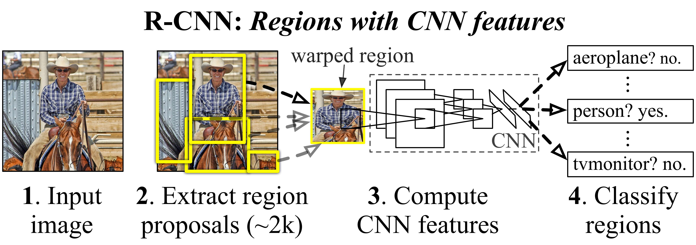

  

# Leveraging Synthetic Data for Real-World Object Detection

By Sergio Sanz, PhD

This article outlines the algorithmic solution developed for the [Synthetic to Real Object Detection Challenge](https://www.kaggle.com/competitions/synthetic-2-real-object-detection-challenge) on Kaggle, organized by [Duality AI](https://www.linkedin.com/company/dualityai/posts/?feedView=all).

  

The competition challenged participants to train models on synthetic images of a Cheerios box (generated via Duality AI’s digital twin simulation software called Falcon) and generalize effectively to unseen real-world images.

The proposed model is based on PyTorch's Region-based Convolutional Neural Network (R-CNN), specifically the [Faster R-CNN](https://arxiv.org/abs/1506.01497) implementation.

A central component of the proposed method is an augmentation-based regularization strategy to enhance generalization. Strong data augmentation techniques, including horizontal and vertical flip, zooming out, occlusions, color jittering, and resolution scaling, are applied throughout training.

Additional highlights of this approach include:

1. **Synthetic-only training:** No real-world images were used during training or validation.
2. **No pseudo-labeling:** The model was trained solely on the labeled synthetic data provided in the competition.
3. **Pre-trained backbone:** A Faster R-CNN model leveraging a pre-trained backbone was fine-tuned on the synthetic Cheerios box dataset provided in the competition.

  

## Data Preprocessing: Augmentation
Object detection performance can be enhanced by generating additional synthetic Cheerio box scenes using the Falcon editing software, alongside the original dataset. These new scenes can introduce variations such as occlusions and changes in pixel brightness and color. Alternatively, applying transformations to the original dataset offers a simple yet effective way to diversify the training data.

A data augmentation pipeline is employed in this project to improve model generalization. It includes various transformations such as resolution scaling, color jittering, horizontal and vertical flipping, zooming out, and most notably occlusions. Plenty of occlusions are introduced to simulate edge cases (see Figure 1).

Occlusions are implemented by randomly adding colored circles and rectangles to the images. Additionally, a synthetic bush texture, sourced from the Falcon editor’s texture dataset, is overlaid using class-specific masks to further simulate complex, real-world scenarios.

  

  <figcaption>Figure 1: An example of original synthetic image  before (left) and after augmentation transformations.</figcaption>

## The Object Detection Model: Faster R-CNN
``Faster R-CNN`` was selected as the object detection architecture due to its strong balance between accuracy and efficiency. It is widely recognized for delivering state-of-the-art performance across various object detection tasks, leveraging a two-stage detection pipeline. This model contains 43.2 million parameters and has a size of 173.4 MB.

The model consists of three main stages, described below:

### Region Proposal Network (RPN)

The first stage involves scanning the image to identify regions (i.e., bounding boxes) that are likely to contain objects. This step estimates ``objectness``, which is the probability that a given region contains an object rather than background.

Feature extraction for this stage is performed using the [ResNet50_FPN_v2](https://pytorch.org/vision/main/models/faster_rcnn.html) backbone.

### Classification and Bounding Box Regression

Once the Regions of Interest (RoI) are proposed by the RPN, the second stage classifies the content of each region (e.g., pedestrian, dog, table, book, Cheerios box) and refines the coordinates of the bounding boxes. The figure below shows a block diagram of the Faster R-CNN architecture.

  

  <figcaption>Figure 2: Block diagram of the Faster R-CNN architecture. Source: R. Girshick, et al. "Rich Feature Hierarchies for Accurate Object Detection and Semantic Segmentation," 2014 IEEE Conference on Computer Vision and Pattern Recognition, June 2014.</figcaption>

### Bounding Box Pruning

The R-CNN model may generate multiple bounding box candidates, some of which correspond to the same object or parts of it. To produce cleaner outputs, bounding boxes with the lowest confidence scores are removed during this stage, helping to eliminate redundant detections.

This algorithm has been implemented from scratch and relies on three filtering stages, each with thresholds fine-tuned through cross-validation:

* **Score threshold:** The minimum confidence score required to retain a bounding box.
* **IoU threshold:** The Non-Maximum Suppression (NMS) algorithm, available in PyTorch, is applied to iteratively remove lower-scoring boxes that have an Intersection over Union (IoU) greater than the defined threshold with a higher-scoring box. In simpler words, a lower IoU threshold results in more aggressive removal of overlapping predictions.
* **Area-based best candidate selection (optional):** If two or more boxes still remain after the previous steps, the one with the largest area is selected. This heuristic assumes that smaller boxes are more likely to be spurious. Alternatively, a different selection criterion, such as choosing the box with the highest confidence score, can be applied. This stage is useful when it is known in advance that at most one object of a given class is present in the image.

## Training and Cross-Validation
The model was trained using the PyTorch framework with the following configuration:

* Learning rate: 1e-5
* Batch size: 4
* Optimizer: AdamW
* Scheduler: CosineAnnealingLR
* Number of epochs: 30

### Loss Function

The Faster R-CNN model returns a dictionary containing the following loss components:

* **Classification loss:** Cross-entropy loss between predicted and ground-truth class labels for each RoI.
* **Bounding box regression loss:** It measures how accurately the predicted bounding boxes align with the ground-truth boxes.
* **Objectness loss:** It helps the RPN determine whether an anchor box contains an object or background.
* **RPN box regression loss:** It evaluates how well the RPN refines anchor boxes to match ground-truth object locations.

The overall loss used for training and cross-validation is the sum of these individual components.

## Experimental Results
The Faster R-CNN model was evaluated on the test dataset provided by Duality AI as part of this Kaggle competition. Model performance was measured using the Mean Average Precision at IoU threshold 0.50 (mAP@50).

Figure 3 presents two representative examples demonstrating the performance of the proposed model, which achieved perfect object detection. The model achieved the maximum score of 1.0 on the leaderboard.

  

  <figcaption>Figure 3: Object detection results on unseen real-world test images.</figcaption>

## Conclusion

The proposed approach demonstrates the effectiveness of using synthetic data alongside a robust object detection architecture and strong data augmentation techniques to address real-world object detection tasks.

The proposed Faster R-CNN model achieved outstanding performance on real-world test data for the Cheerios box dataset, highlighting the potential of simulation-driven approaches in computer vision.
